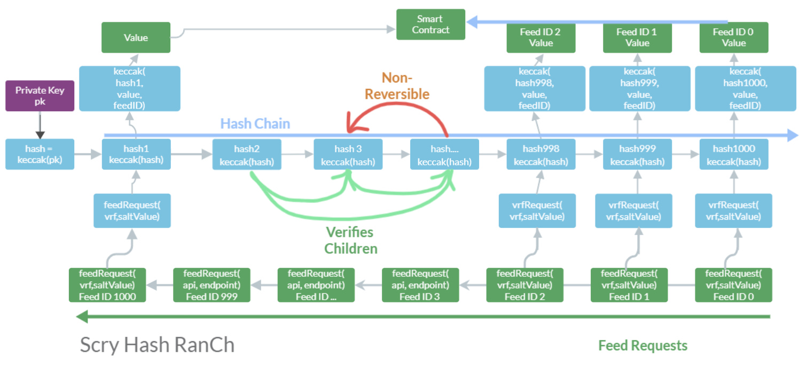

# VRF Hash RanCh

In smart contract development, ensuring the security and tamper-proof nature of data is of utmost importance, particularly when random number generation is involved. Manipulation of such data can cause significant damage to the entire system. To tackle this problem, Scry introduces HashRanCh, a Verifiable Random Function (VRF) that provides a secure and verifiable way of generating random numbers in smart contracts.

HashRanCh VRF Hashing Process: The VRF hashing process involves the following steps:

Step 1: Use the private key of the oracle as the seed for the VRF hash. This step ensures that the hash is unique to the oracle and cannot be manipulated by external factors.

Step 2: Compute a sequence of hashes starting from the seed. The number of hashes to compute is determined by subtracting the feedID from 100,000. This is done to generate a unique random number for each input value without revealing the seed for future values.

Step 3: Hash the VRF seed with the request to get a value. This value can be used wherever needed in the smart contract.

Step 4: The verifiers can then check that the seed for their hash is the parent seed for all other hashes that have been committed, but not for future hashes. This ensures that the oracle could not have known the value without knowing the salt that was going to be provided as well as which ID was going to request it at the very start of the oracle's deployment.

<figure><figcaption></figcaption></figure>

### Verifier

You can use the verifier to verify that any value from the oracle was created using the same seed.

```javascript
const ethers = require('ethers');
const keccak256 = require('keccak256')

vrf('84873780516009912569194631296549285263857465976223993627479128106633463637632', //PROOF HASH
  7, // REQ ID PARENT
  1,// REQ ID VERIFY
  'LOL', //SALT
  '9879752290979272170120564511694725973244445080113496454172745156547599793834' // VALUE
)

async function vrfHashCheck(upstream, start, feedID, salt, value) {
  let hash = upstream;
  hash = ethers.utils.hexValue(ethers.BigNumber.from(hash));
  let stop = start - feedID
  console.log('seed ', hash);
  let hash2
  if (start - feedID > 0) {
  for (let i = 0; i < stop; i++) {
    hash = ethers.utils.keccak256(hash);
    //console.log('VRF ', hash);
  }}
  hash2 = keccak256(hash + salt + feedID).toString('hex')
  console.log('VRF seed ', hash);
  let hashBN = ethers.BigNumber.from(hash);
  let uint256 = hashBN
  hashBN = ethers.BigNumber.from('0x' + hash2);
  uint256 = hashBN
  hash2 = uint256.toString()
  console.log(feedID, ' ID with VRF ', hash2);
  if (value == hash2) {
    console.log('\x1b[32m%s\x1b[0m', 'Value and hash match! Value authd.');
  } else {
    console.log('\x1b[31m%s\x1b[0m', 'Value and hash do not match!');
  }
}
async function vrf(upstream, startID, tfeedID, salt, value) {
  await vrfHashCheck(upstream, startID, tfeedID, salt, value)
  console.log('expected ', value);
}
```

### Function: vrf

**Description:** This function calls the vrfHashCheck function and logs the expected hash value to the console.

**Syntax:**

```javascript
sync function vrf(upstream, startID, tfeedID, salt, value)
```

**Parameters:**

* `upstream` (string): The proof hash.
* `startID` (number): The ID of a parent request proof.
* `tfeedID` (number): The ID of the request to be verified.
* `salt` (string): The salt value used in the VRF
* `value` (string): The expected hash value.

**Return Value:** This function does not return any value, but it logs the expected hash value to the console.

Sample

```
vrf(
The uint from a proof. Remember that the proof will be for the previous request ID using Morpheus not the current ID.
'84873780516009912569194631296549285263857465976223993627479128106633463637632', 
//PROOF HASH UINT
 7, 
// REQ ID PARENT 
1,
// REQ ID VERIFY 
'LOL',
 //SALT '9879752290979272170120564511694725973244445080113496454172745156547599793834'
 // VALUE TO VERIFY)
```

```javascript
seed  0xbba4db7f38852a1feb6bc4266d8e857a7c31a838a00c3fe4f392e92dfbf4a680
VRF seed  0xadcbdf1fce290c09ecb84b430d4d15f2d2abaebe15b368e41736b5e07895a29b
1  ID with VRF  9879752290979272170120564511694725973244445080113496454172745156547599793834
Value and hash match! Value authd.
expected  9879752290979272170120564511694725973244445080113496454172745156547599793834
```

