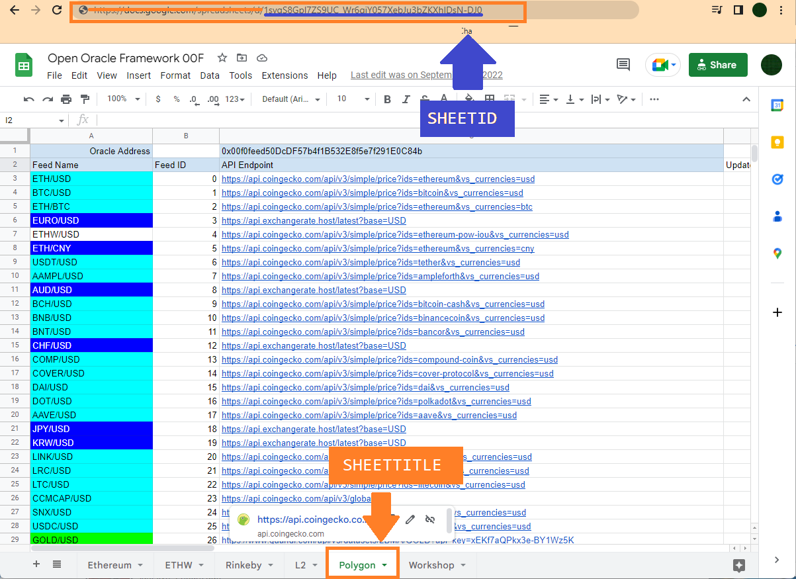

# Oracle Spreadsheet Management and Creation

To set up your Spreadsheet for Scry Node, simply copy this template or use as a guide for how to structure your sheet.\
\
**Creation**

1.  Go to \
    [https://docs.google.com/spreadsheets/d/1syqS8Gpl7ZS9UC\_Wr6giY057XebJu3bZKXhIDsN-DJ0/](https://docs.google.com/spreadsheets/d/1syqS8Gpl7ZS9UC\_Wr6giY057XebJu3bZKXhIDsN-DJ0/edit#gid=0)\
    Copy this template or use as a guide for how to structure your sheet. \
    \
    **Feed Name**\
    The name for the feed, used as general info\
    **ETH/USD**\
    \
    **Feed ID**\
    The ID for the feed in the oracle\
    **0**\
    \
    **API Endpoint**\
    The API Endpoint to source data from. This can be any API\
    [https://api.coingecko.com/api/v3/simple/price?ids=ethereum\&vs\_currencies=usd](https://api.coingecko.com/api/v3/simple/price?ids=ethereum\&vs\_currencies=usd)\
    \
    \
    **Update Frequency (s)**\
    How often you want the feed to be updated with fresh data, also determines how often to map slots for historical lookup\
    **3600**\
    \
    **Decimals**\
    How many dec for the data to be stored in, recommended the raw base amount for Crypto assets, such as 10\*\*18 for ETH values.\
    **18**\
    \
    **Parser**\
    The JSON path to walk down for the value to return\
    For an API request to Coingecko like\
    [https://api.coingecko.com/api/v3/simple/price?ids=ethereum\&vs\_currencies=usd](https://api.coingecko.com/api/v3/simple/price?ids=ethereum\&vs\_currencies=usd)\
    which returns\


    ```
    {"ethereum":{"usd":1609.34}}
    ```

&#x20;       The path would be\
&#x20;       **ethereum,usd**

&#x20;       **Description**\
&#x20;       The Description for the feed

2\. Follow [https://support.google.com/googleapi/answer/6158862?hl=en](https://support.google.com/googleapi/answer/6158862?hl=en) to acquire your API key

3\. You can now access the needed info from your oracle with the following values\
**SHEETID=** URLID - **1syqS8Gpl7ZS9UC\_Wr6giY057XebJu3bZKXhIDsN-DJ0**\
**SHEETTITLE=** The TITLE for the specific sheet - **Polygon**\
**SHEETAPI=**API KEY

<figure><figcaption></figcaption></figure>

**New Feeds**\
1\. Simply put new Feeds into the sheet with ID and needed info for the APIs, run setup.js and then restart your node.
